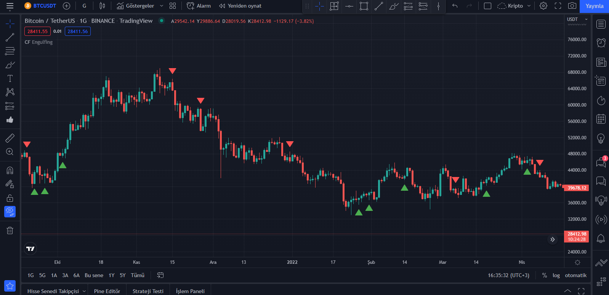

# CandleStick-Formations-Indicator
 
 Candle Stick Formations Indicator For TradingView

 ### Warning Note:
 It is not for generating buy-sell signals. Marks some candle formations on the chart.
 Making a trading decision with this indicator alone can have negative consequences!

### Formations:
-PinBar
-Soldier(One White Soldier, One Black Crow)
-Engulfing
-InBar(Insight Bar)

### Screenshot

  </img>

### Code

```js
// This source code is subject to the terms of the Mozilla Public License 2.0 at https://mozilla.org/MPL/2.0/
// © GokhanAltun

//@version=5
indicator("Candle Formations", shorttitle = "CF", overlay = true, max_labels_count = 500)

// === Inputs ===
formation = input.string(title = "Formation-Type", defval = "PinBar", options = ["PinBar", "Engulfing", "Soldier", "InBar"])


// === Functions ===
pin_bar()=>

    limit = ((high - low)/3)*1.8
    
    candle_type = close > open ? true : false
    
    up_pin = 0.0
    down_pin = 0.0
    
    if candle_type
        up_pin := high - close
        down_pin := open - low

        if up_pin > down_pin and up_pin >= limit
            label.new(bar_index, high, yloc = yloc.abovebar, color = color.red, style = label.style_triangledown, size = size.tiny)
        else if down_pin > up_pin and down_pin >= limit
            label.new(bar_index, low, yloc = yloc.belowbar, color = color.green, style = label.style_triangleup, size = size.tiny)
    
    if candle_type == false
        up_pin := high - open
        down_pin := close - low

        if up_pin > down_pin and up_pin >= limit
            label.new(bar_index, high, yloc = yloc.abovebar, color = color.red, style = label.style_triangledown, size = size.tiny)
        else if down_pin > up_pin and down_pin >= limit
            label.new(bar_index, low, yloc = yloc.belowbar, color = color.green, style = label.style_triangleup, size = size.tiny)


engulfing()=>
    
    if close > open and close[1] < open[1]
        
        if close > open[1] and open < close[1]
            label.new(bar_index, low, yloc = yloc.belowbar, color = color.green, style = label.style_triangleup, size = size.tiny)
    
    if close < open and close[1] > open[1]
        
        if open > close[1] and close < open[1]
            label.new(bar_index, high, yloc = yloc.abovebar, color = color.red, style = label.style_triangledown, size = size.tiny)


soldier()=>

    if close > open and close[1] < open[1]
        
        if open > close[1] and low > low[1] and close > open[1] and high > high[1]
            label.new(bar_index, low, yloc = yloc.belowbar, color = color.green, style = label.style_triangleup, size = size.tiny)
    
    if close < open and close[1] > open[1]
        
        if close < open[1] and low < low[1] and open < close[1] and high < high[1]
            label.new(bar_index, high, yloc = yloc.abovebar, color = color.red, style = label.style_triangledown, size = size.tiny)


inBar()=>
    if high < high[1] and low > low[1]
        label.new(bar_index, low, yloc = yloc.belowbar, color = color.green, style = label.style_triangleup, size = size.tiny)


formation_type() =>
    if formation == "PinBar"
        pin_bar()
    else if formation == "Engulfing"
        engulfing()
    else if formation == "Soldier"
        soldier()
    else if formation == "InBar"
        inBar()


formation_type()

plot(na)
```


    


